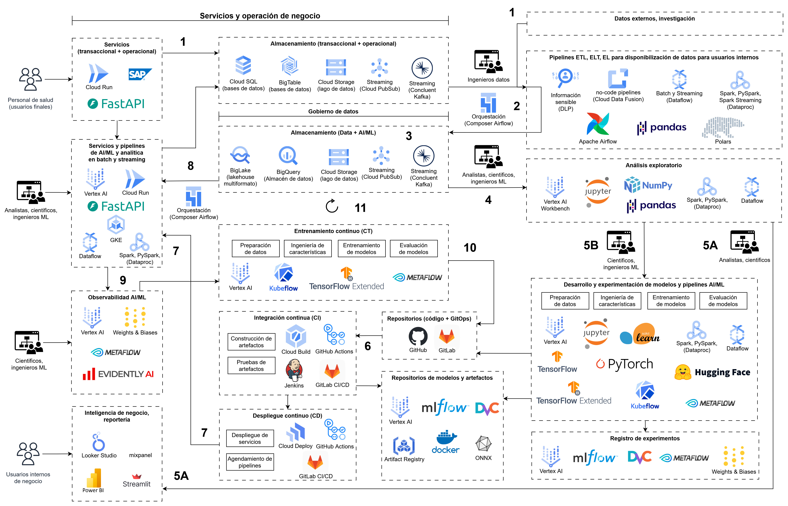

# MLOps Demo Caso Salud

El siguiente repo presenta una propuesta de diseño base y demo básico MLOps considerando un caso del sector salud.

**Caso de trabajo:** "Se requiere construir un modelo que sea capaz de predecir, dados los datos de síntomas de un paciente, si es posible o no que este sufra de alguna enfermedad. Esto se requiere tanto para enfermedades comunes (muchos datos) como para enfermedades huérfanas (pocos datos)."

Contenido:
- [Diseño MLOps](#diseño-mlops)
- [Demo Docker](#demo-docker)
- [Referencias](#referencias)


# Diseño MLOps

El siguiente diseño es una propuesta base de una ruta general para implementar un sistema de AI/ML según requerimientos específicos del problema y la organización. Si bien presenta un escenario con múltiples roles y tareas, se pueden simplificar según capacidades disponibles. Se referencian servicios y tecnologías principalmente de Google Cloud y algunas alternativas de uso libre.



**1. Fuente de datos**: se considera inicialmente que la principal fuente de datos corresponde a los sistemas de entrada que utiliza el personal de salud para describir las condiciones y procesos clínicos de los pacientes, es decir, los sistemas operacionales y transaccionales. Sin embargo, según requerimientos específicos, se podrían extraer datos de otras fuentes de referencia, por ejemplo, de investigación. Estos datos podrían ser tanto estructurados o no estructurados.

**2. Disponibilización de datos**: la disponibilización de datos a usuarios internos (analistas, científicos, ingenieros ML, especialistas de negocio) se realiza a través de pipelines ETL, ELT, y ET, tanto en batch como en streaming, implementados por ingenieros de datos, principalmente para asegurar compatibilidad y cumplir con normatividad aplicable, por ejemplo, privacidad de datos. La ejecución de esta tarea puede ser automatizada y orquestada de manera periódica.

**3. Almacenamiento de datos para analítica y AI/ML**: la segmentación de sistemas de almacenamiento enfocados a analítica y AI/ML optimiza los recursos de infraestructura según el tipo de uso; facilita la integración con herramientas de procesamiento, análisis y modelamiento; y permite implementar gobierno de datos. Se presentan tecnologías escalables y elásticas según requerimientos específicos del caso.

**4. Análisis exploratorio de datos**: el análisis exploratorio de datos es crucial para conocer y describir las características y condiciones de los datos disponibles. Esto para identificar las características (features) más relevantes para los modelos, o contestar preguntas de negocio. Dependiendo del propósito específico, este análisis lo podrían realizar analistas, científicos de datos, e ingenieros ML. Según los requerimientos específicos del caso, se podría ejecutar en una máquina (local o en la nube) o en servicios escalables como los presentados Dataproc (Spark, PySpark) o Dataflow de Google Cloud.

**5A. Inteligencia de negocio y reportería**: la presentación y reportería de descriptores, perspectivas, y conclusiones de negocio a usuarios internos como tomadores de decisión hace parte de la estructura fundamental de un sistema de datos y analítica para orientar estrategias y operaciones. La ejecución de esta tarea puede ser automatizada y orquestada de manera periódica.

**5B. Desarrollo y experimentación de modelos y pipelines AI/ML**: las estrategias para desarrollar, optimizar, y experimentar con modelos y pipelines de AI/ML se ejecutan a través de las etapas de preparación de datos, exploración y definición de características (ingeniería de características), entrenamiento y evaluación de modelos. Esta fase puede realizarse en local o a través de servicios escalables según requerimientos específicos. Se recomienda utilizar un registro de experimentos, así como un repositorio de los modelos desarrollados.

**6. Integración continua a partir de actualización de repositorios Git**: un flujo CI/CD inicia con la actualización del repositorio de código, y opcionalmente el repositorio GitOps. La integración construye los artefactos de modelos y pipelines, prueba sus funcionalidades, y si las pruebas son exitosas entonces actualiza los repositorios de modelos y artefactos.

**7. Despliegue continuo:** despliegue de los artefactos como servicio y pipelines con ejecución automatizada y orquestada. Los servicios son accedidos por la capa de servicios transaccionales y operacionales, y por analistas, científicos, e ingenieros ML.

**8. Analítica operacional**: los servicios y pipelines de AI/ML pueden procesar datos recientes del sistema para automatizar ajustes de la operación que optimicen el cumplimiento de objetivos de negocio. Estos procesos se implementan principalmente en tiempo real, sin embargo, según requerimientos se pueden ejecutar de manera periódica.

**9. Observabilidad AI/ML**: en producción se deben monitorear la deriva de datos (data drift) y la deriva de concepto (concept drift) para mantener la efectividad de los servicios y pipelines de AI/ML. En caso que se presenten desviaciones, es posible reentrenar los modelos como respuesta del sistema.

**10. Flujo CI/CD automatizado de reentrenamiento:** si se tiene un grado de madurez de procesos que asegura el reentrenamiento de modelos con una alta evaluación de sus métricas, este reentrenamiento puede iniciar un flujo de CI/CD de manera automatizada. En su defecto, la decisión de actualizar los modelos utilizados en producción es aprobada de manera manual.

**11. Entrenamiento continuo:** el reentrenamiento continuo de modelos a partir de nuevos datos es un proceso que requiere un grado avanzado de madurez y robustez al sistema, infraestructura y equipo técnico. Es importante precisar que no todos los sistemas y casos lo requieren, sino que un reentrenamiento periódicamente puede ser suficiente.


# Demo Docker

El siguiente es un servicio básico RESTful HTTP para implementar operaciones de MLOps. Este servicio retorna las siguientes categorías de condición de enfermedad de un paciente a partir de la temperatura, el ritmo cardiaco, y la presión sanguínea como parámetros de consulta (query params):
- "NO ENFERMO"
- "ENFERMEDAD LEVE"
- "ENFERMEDAD AGUDA"
- "ENFERMEDAD CRÓNICA"

NOTA: LA SIGUIENTE ES UNA FUNCIONALIDAD SIN NINGÚN SUSTENTO MÉDICO, SOLO ES UN MOCK DE UN MODELO DE CLASIFICACIÓN.

Construcción y ejecución local con Docker:
```bash
# construir imagen
docker build -t svc-demo-salud .

# ejecutar contenedor en puerto 5000
docker run --rm --name demo-salud -p 5000:80 svc-demo-salud
```

Solicitar predicciones a través del navegador web:
- http://localhost:5000/predict?temperature=36&heart_rate=120&blood_pressure=90
- http://localhost:5000/predict?temperature=38&heart_rate=120&blood_pressure=90
- http://localhost:5000/predict?temperature=38.5&heart_rate=140&blood_pressure=90
- http://localhost:5000/predict?temperature=36&heart_rate=150&blood_pressure=180

En su defecto en terminal:
```bash
# método GET
curl "http://localhost:5000/predict?temperature=36&heart_rate=120&blood_pressure=90"

# método POST
curl -X POST "http://localhost:5000/predict?temperature=36&heart_rate=120&blood_pressure=90"
```

Remover imagen de docker:
```bash
docker rmi svc-demo-salud
```


# Referencias

- https://cloud.google.com/discover/what-is-mlops
- https://cloud.google.com/architecture/mlops-continuous-delivery-and-automation-pipelines-in-machine-learning
- https://fastapi.tiangolo.com/deployment/docker/
